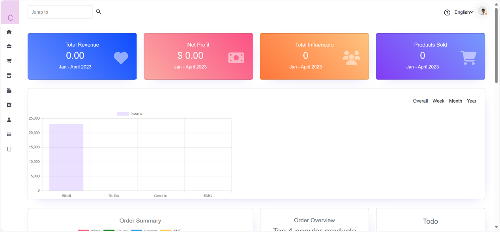
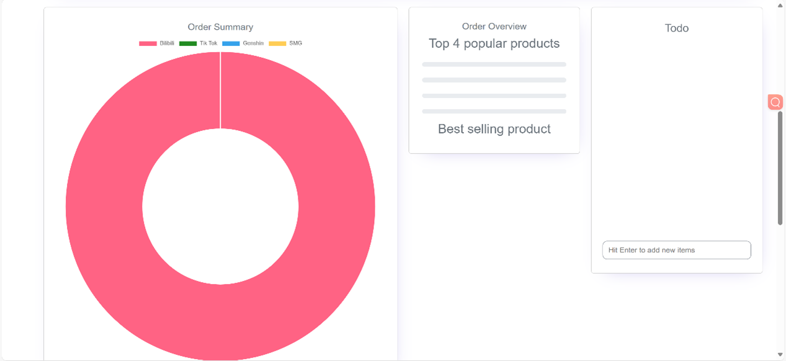
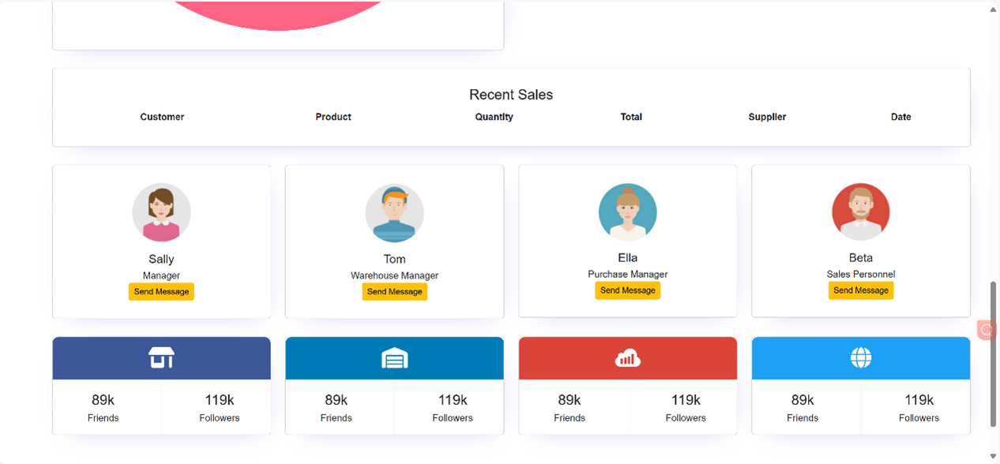
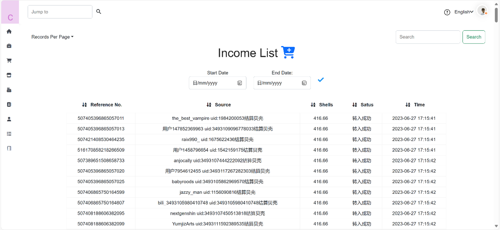

### Software Development Intern | UniFuture Technology Co. Ltd., Ningbo, China (02.2023 – 09.2023)
#### Project 1: SaaS Platform for Company Account Management
**Overview:** During my internship at UniFuture Technology Co. Ltd., I contributed to the development of a comprehensive SaaS platform aimed at enhancing company account management processes. The platform was built using Java, Vue.js, and Spring Boot, and it resulted in a 27% increase in user engagement and system reliability.

**Key Contributions:**

1. **Platform Development**:
   1. Developed core functionalities such as user authentication, data encryption, and RESTful API creation with Spring Boot.
   1. Improved system reliability and user engagement by 27% through optimized development practices.
1. **Database Optimization**:
   1. Migrated and normalized the database schema to PostgreSQL, which improved query performance and data integrity for user profiles and company-specific accounts.
1. **User Interface & Experience**:
   1. Designed and implemented a user-friendly interface using Vue.js, enhancing the overall user experience.
   1. Integrated complex data visualization tools like matplotlib to present financial metrics such as Total Revenue and Net Profit.

**Features Demonstrated in the Demo:** *Note: The following features are part of a demo, created solely for portfolio purposes. The full application and its proprietary code belong to UniFuture Technology Co. Ltd., and cannot be shared.*

1. **Financial Overview**:
   
   
   1. **Total Revenue & Net Profit**: Financial data for a specific period is calculated using Java-based algorithms and visualized using tools like matplotlib.
   
1. **Order Management**:

   )

   1. **Order Summary**: Developed with Vue.js and Node.js, this section provides a concise view of tasks, popular products, and order details.

1. **Sales Analysis**:

   )

   1. **Recent Sales**: Python and MySQL were used to develop this feature, which includes detailed information on customers, products, quantities, and sales dates.

1. **Income Tracking**:

   )

   1. **Income List**: PostgreSQL and Spring Boot were employed to manage and retrieve data, showcasing settlement records with details such as "Reference No.", "Source", and "Status".

**Demo Disclaimer**:
This web application is the intellectual property of UniFuture Technology Co. Ltd. The demo provided here is for illustrative purposes only, showcasing the contributions I made during my internship. The full application and its source code are proprietary and confidential.